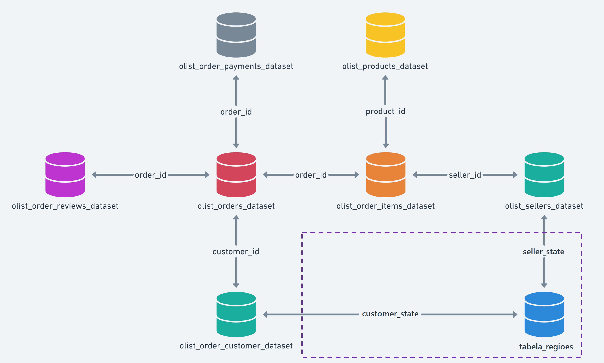

# Projeto de Conclusão da Disciplina "Data Analytics" do MBA em Data Science da Famesp em parceria com a FLAI

Outubro/2023

---

## Índice

<!--ts-->
   * [Descrição do Projeto](https://github.com/adriana-takahagui/mba-machine-learning#descrição-do-projeto)
   * [Descrição do Problema de Negócio](https://github.com/adriana-takahagui/mba-machine-learning#descrição-do-problema-de-negócio)
   * [Dicionário de Variáveis](https://github.com/adriana-takahagui/mba-machine-learning#dicionário-de-variáveis)
   * [Metodologia de Desenvolvimento](https://github.com/adriana-takahagui/mba-machine-learning#metodologia-de-desenvolvimento)
   * [Próximos Passos](https://github.com/adriana-takahagui/mba-machine-learning#próximos-passos)
   * [Fontes e Referências](https://github.com/adriana-takahagui/mba-machine-learning#fontes-e-referências)
<!--te-->

---

## Descrição do Projeto

**Disciplina**: Machine Learning 

**Requisitos**: 

- [X] Criar um modelo de Machine Learning, com uma base de dados à sua escolha, com um desenho claro de qual é o problema de negócio, como o modelo auxiliará a empresa a resolver esse problema, e como se dará o piloto para avaliar o sucesso do uso do modelo.
- [X] Responder cada uma das questões abaixo, e entregar as respostas juntamente com o notebook contendo o código de modelagem executado.
  - Descreva o problema/dor de negócio que você pretende auxiliar desenvolvendo seu modelo.
  - Quais dados você tem disponíveis para entender o problema e criar uma solução?
  - Como você utilizará Machine Learning para auxiliar nesse problema?
  - Como o modelo será utilizado no dia-a-dia pela área de negócio?
  - Qual a métrica de avaliação que deve ser utilizada para o seu modelo?
  - Como devemos avaliar se o modelo está funcionando (desenho do piloto)?

---

## Descrição do Problema de Negócio

Esta seção aborda a descrição do problema de negócio escolhido para desenvolver o projeto da disciplina "Machine Learning".

**Tema**: Predição de NPS: prevendo os detratores de uma empresa de e-Commerce.

**Objetivo**:  

- Criar um modelo de Machine Learning interpretável, ou seja, um modelo em que seja possível não só prever a variável resposta mas também entender quais variáveis são importantes para o problema proposto, quais são os pesos de cada variável escolhida para o modelo e as probabilidades de cada saída (output) do modelo.
- Para este projeto, será desenvolvimento um modelo de classificação para prever os detratores.
- E para a interpretabilidade do modelo, escolheu-se a Regressão Logística.

**Problema de Negócio**: 

- A Olist é uma empresa de comércio eletrônico do Brasil que oferece uma plataforma de marketplace para conectar vendedores e seus produtos aos consumidores finais.
- E como toda empresa, ela precisa medir o quão satisfeitos os seus consumidores estão através de uma métrica denominada NPS, que é uma medida não somente da satisfação do cliente, mas também está correlacionada com o faturamento de uma empresa. Esta métrica já é adotada por diversas empresas, de diversos portes e setores do mercado.
- Por ser uma métrica importante e com o intuito de melhorar a retenção de consumidores, para que estes voltem a comprar e sejam promotores da marca, notou-se a oportunidade de desenvolver um modelo de Machine Learning para ***predição de NPS para prever detratores, ou seja, consumidores insatisfeitos***.
- A partir desse modelo, ***entender o perfil dos detratores e quais fatores contribuem para sua insatisfação*** com a finalidade de criar ações e estratégias para reduzir o atrito, melhorar a experiência da jornada de compra do cliente e sua satisfação em relação à marca. 

**Fontes de Dados**:

- Foram utilizados dados de um conjunto de dados público localizado no Kaggle. Os dados se referem a pedidos realizados na Olist (um e-commerce brasileiro) entre 2016 e 2018.
- Segue link do Kaggle: https://www.kaggle.com/datasets/olistbr/brazilian-ecommerce/
- O conjunto de dados em questão é formado pelos arquivos abaixo (OBS: a lista abaixo consta apenas os arquivos utilizados neste projeto):
  - **olist_orders_dataset.csv**: dados de pedidos
  - **olist_order_items_dataset.csv**: dados com itens que formam cada pedido
  - **olist_order_payments_dataset.csv**: dados de pagamento do pedido
  - **olist_customers_dataset.csv**: dados de clientes
  - **olist_products_dataset.csv**: dados de produtos
  - **olist_sellers_dataset.csv**: dados de vendedores
  - **olist_order_reviews_dataset.csv**: dados com avaliações dadas pelos consumidores em relação ao seu pedido
- Além desses dados, também foi utilizada uma **tabela de regiões e estados do Brasil**.

**Link do Notebook**: https://github.com/adriana-takahagui/mba-machine-learning/blob/main/Customer_Satisfaction_Prediction_Ecommerce.ipynb
- **OBS**: Para visualizar os gráficos gerados pelo Sweetviz, tente abrir pelo link do Colab clicando [aqui](https://colab.research.google.com/github/adriana-takahagui/mba-machine-learning/blob/main/Customer_Satisfaction_Prediction_Ecommerce.ipynb).
- Caso não consiga, uma versão em HTML pode ser encontrado clicando [aqui](https://github.com/adriana-takahagui/mba-machine-learning/tree/main/sweetviz).

**Link do Material com as respostas**: As respostas às perguntas propostas em "Descrição do Projeto" - "Requisitos" podem ser encontradas [neste arquivo PDF](https://github.com/adriana-takahagui/mba-machine-learning/blob/main/MBA_Machine_Learning_Customer_Satisfaction.pdf). 

---

## Dicionário de Variáveis

Esta seção descreve as tabelas e as variáveis utilizadas no projeto e na resolução do problema proposto.

O projeto foi desenvolvido utilizando um conjunto de dados público disponibilizado pela Olist no Kaggle. Esse conjunto possui a seguinte estrutura e tabelas:

**Descrição das variáveis com origem em: olist_orders_dataset.csv**

| N |            Variável           | Tipo do Dado |                               Descrição                                  |     Valores Permitidos    |
|:-:|-------------------------------|:------------:|--------------------------------------------------------------------------|---------------------------|
| 1 | order_id                      |    String    | Identificador único do pedido                                            | Não enumerado             |
| 2 | customer_id                   |    String    | Chave para o dataset 'customer'. Cada pedido possui um único customer_id | Não enumerado             |
| 3 | order_status                  |    String    | Status do pedido                                                         | Delivered; Cancelled      |
| 4 | order_purchase_timestamp      |  Data e Hora | Data e Hora do pedido de cada item                                       | Formato: dd/mm/aaaa hh:mm |
| 5 | order_approved_at             |  Data e Hora | Data e Hora de aprovação do pagamento                                    | Formato: dd/mm/aaaa hh:mm |
| 6 | order_delivered_carrier_date  |  Data e Hora | Data de postagem do pedido                                               | Formato: dd/mm/aaaa hh:mm |
| 7 | order_delivered_customer_date |  Data e Hora | Data real de entrega do pedido do cliente                                | Formato: dd/mm/aaaa hh:mm |
| 8 | order_estimated_delivery_date |  Data e Hora | Data estimada da entrega informada ao cliente no momento da compra       | Formato: dd/mm/aaaa hh:mm |

**Descrição das variáveis com origem em: olist_order_items_dataset.csv**

| N |       Variável      | Tipo do Dado |                                               Descrição                                                 |     Valores Permitidos    |
|:-:|---------------------|:------------:|---------------------------------------------------------------------------------------------------------|---------------------------|
| 1 | order_id            |    String    | Identificador único do pedido                                                                           | Não enumerado             |
| 2 | order_item_id       |    Inteiro   | Número sequencial identificando o número de itens dentro do mesmo pedido                                | Não enumerado             |
| 3 | product_id          |    String    | Identificador único do produto                                                                          | Não enumerado             |
| 4 | seller_id           |    String    | Identificador único do vendedor                                                                         | Não enumerado             |
| 5 | shipping_limit_date |  Data e Hora | Data de limite para envio do produto pelo vendedor                                                      | Formato: dd/mm/aaaa hh:mm |
| 6 | price               |    Decimal   | Preço de custo de cada item                                                                             | Não enumerado             |
| 7 | freight_value       |    Decimal   | Valor do frete do item (Se um pedido tiver mais de um item, o valor do frete é dividido entre os itens) | Não enumerado             |

**Descrição das variáveis com origem em: olist_order_payments_dataset.csv**

| N |       Variável       | Tipo do Dado |                               Descrição                                  |            Valores Permitidos            |
|:-:|----------------------|:------------:|--------------------------------------------------------------------------|------------------------------------------|
| 1 | order_id             |    String    | Identificador único do pedido                                            | Não enumerado                            |
| 2 | payment_sequential   |    Inteiro   | Número sequencial em caso de pagamento em mais de um método de pagamento | Não enumerado                            |
| 3 | payment_type         |    String    | Método de pagamento escolhido pelo cliente                               | credit_card, boleto, voucher, debit_card |
| 4 | payment_installments |    Inteiro   | Número de parcelas escolhidas pelo cliente                               | Não enumerado                            |
| 5 | payment_value        |    Decimal   | Valor da transação                                                       | Não enumerado                            |

**Descrição das variáveis com origem em: olist_customers_dataset.csv**

| N |         Variável         | Tipo do Dado |                         Descrição                            |                 Valores Permitidos                |
|:-:|--------------------------|:------------:|--------------------------------------------------------------|---------------------------------------------------|
| 1 | customer_id              |    String    | Chave para "orders". Cada pedido possui um customer_id único | Não enumerado                                     |
| 2 | customer_unique_id       |    String    | Identificador alfanumérico único do cliente                  | Não enumerado                                     |
| 3 | customer_zip_code_prefix |    Inteiro   | Primeiro cinco dígitos do CEP de localização do cliente      | Cinco dígitos                                     |
| 4 | customer_city            |    String    | Cidade de localização do cliente                             | Conjunto contendo apenas os municípios do Brasil  |
| 5 | customer_state           |    String    | Estado de localização do cliente                             | Conjunto contendo apenas os 26 estados do Brasil  |

**Descrição das variáveis com origem em: olist_products_dataset.csv**

| N |          Variável          | Tipo do Dado |                      Descrição                         |                Valores Permitidos               |
|:-:|----------------------------|:------------:|--------------------------------------------------------|-------------------------------------------------|
| 1 | product_id                 |    String    | Identificador único do produto                         | Não enumerado                                   |
| 2 | product_category_name      |    String    | Categoria do produto                                   | Não enumerado. Novos departamentos podem surgir |
| 3 | product_name_lenght        |   Inteiro    | Número de caracteres extraídos do nome do produto      | Não enumerado                                   |
| 4 | product_description_lenght |    Inteiro   | Número de caracteres extraídos da descrição do produto | Não enumerado                                   |
| 5 | product_photos_qty         |    Inteiro   | Número de fotos publicadas do produto                  | Não enumerado                                   |
| 6 | product_weight_g           |    Decimal   | Peso do produto em gramas                              | Não enumerado                                   |
| 7 | product_length_cm          |    Decimal   | Comprimento do produto em centímetros                  | Não enumerado                                   |
| 8 | product_height_cm          |    Decimal   | Altura do produto em centímetros                       | Não enumerado                                   |

**Descrição das variáveis com origem em: olist_sellers_dataset.csv**

| N |        Variável        | Tipo do Dado |                       Descrição                          |                 Valores Permitidos                |
|:-:|------------------------|:------------:|----------------------------------------------------------|---------------------------------------------------|
| 1 | seller_id              |    String    | Identificador único do vendedor                          | Não enumerado                                     |
| 2 | seller_zip_code_prefix |    Inteiro   | Primeiro cinco dígitos do CEP de localização do vendedor | Cinco dígitos                                     |
| 3 | seller_city            |    String    | Cidade de localização do vendedor                        | Conjunto contendo apenas os municípios do Brasil  |
| 4 | seller_state           |    String    | Estado de localizado do vendedor                         | Conjunto contendo apenas os 26 estados do Brasil  |

**Descrição das variáveis com origem em: olist_order_reviews_dataset.csv**

| N |         Variável        | Tipo do Dado |                          Descrição                             |     Valores Permitidos     |
|:-:|-------------------------|:------------:|----------------------------------------------------------------|----------------------------|
| 1 | review_id               |    String    | Identificador único da pesquisa de satisfação                  | Não enumerado              |
| 2 | order_id                |    String    | Identificador único do pedido                                  | Não enumerado              |
| 3 | review_score            |    Inteiro   | Nota de avaliação dada pelo cliente na pesquisa de satisfação  | Número inteiro entre 1 e 5 |
| 4 | review_comment_title    |    String    | Título do comentário da avaliação deixada pelo cliente         | Não enumerado              |
| 5 | review_comment_message  |    String    | Comentário da avaliação deixada pelo cliente                   | Não enumerado              |
| 6 | review_creation_date    |  Data e Hora | Data da pesquisa                                               | Formato: dd/mm/aaaa hh:mm  |
| 7 | review_answer_timestamp |  Data e Hora | Data e Hora da resposta dada pelo cliente                      | Formato: dd/mm/aaaa hh:mm  |

---

## Metodologia de Desenvolvimento

O desenvolvimento deste projeto se baseou na metodologia CRISP-DM. 

Imagem que ilustra a estrutura da metodologia CRISP-DM[^1].

A metodologia CRISP-DM é dividida em 6 etapas fundamentais:
1. Entendimento do negócio
2. Entendimento dos dados
3. Preparação dos dados
4. Modelagem
5. Avaliação
6. Implementação 

**1. Entendimento do negócio**:

- O negócio da Olist é baseado na interação entre o consumidor, o marketplace da Olist e o vendedor.
- A princípio, o pedido é realizado pelo consumidor no site da Olist. Este pedido é recebido pelo marketplace da Olist. Com base nas informações do pedido (como categoria do produto, geolocalização, forma de pagamento etc.), uma notificação é encaminhada aos vendedores.
- Após isso, o produto é recebido do vendedor e entregue ao consumidor dentro do prazo estimado de entrega.
- Assim que o cliente recebe o produto, ou caso o prazo estimado de entrega tenha vencido, o consumidor recebe por e-mail uma pesquisa de satisfação onde pode avaliar com uma nota de 1 a 5 o quanto recomendaria a experiência de compra a alguém.

**2. Entendimento dos dados**:

- Os dados foram disponibilizados pela Olist no Kaggle, portanto toda a parte de estruturação das tabelas já foi realizada. Coube uma exploração dos dados para entender e preparar os dados para análise e para criação do Modelo de Machine Learning.

**3. Preparação dos dados**:

- A primeira etapa na preparação dos dados foi realizar uma união de todas as tabelas em uma única tabela para facilitar a análise e para criação do modelo de Machine Learning.  
- Além disso, esta etapa é baseada em tarefas de pré-processamento de dados, como limpeza, transformação e engenharia de variáveis. Isso envolveu tratamento de valores faltantes, codificação de variáveis categóricas, normalização das variáveis numéricas e divisão dos dados em conjuntos de treino e teste. 
- Portanto, são atividades para criar um conjunto de dados pronto para a modelagem.

**4. Modelagem**:

- Para esta etapa, escolheu-se o modelo de Regressão Logística por permitir a interpretação dos pesos de cada variável preditora em relação à variável resposta e entender como as variáveis influenciam a satisfação ou não do cliente. 

**5. Avaliação**:

- A princípio, a avaliação do modelo foi feita através da acurácia, curva ROC AUC e matriz de confusão. Outras métricas deveram ser utilizadas para avaliar o modelo. 

**6. Implementação**:

- Uma vez que o modelo esteja criado, foi avaliado para dados que nunca tinha visto antes e teve bons resultados em relação às métricas de avaliação, ele poderá ser implementado para ser utilizado no dia a dia do negócio, ou na frequência em que for pertinente. 
- Como ele é um modelo para auxiliar no entendimento das variáveis e seus pesos na satisfação do cliente ou não, no caso, o modelo foi criado para entender os detratores, o modelo poderá ser utilizado alternando-se com as ações implementadas para verificar a eficácia tanto das ações quanto do modelo criado. 

---

## Próximos Passos

- Melhorar o modelo proposto.
- Criar um modelo de Regressão utilizando Regressão Linear para avaliar a predição das notas e realizar a interpretação dos pesos e resultado.
- Tanto no modelo de classificação quanto de regressão, realizar interação de variáveis, análise de outliers, análise de correlação.
- Criar um painel de acompanhamento do modelo / apresentação dos resultados.

---

## Fontes e Referências

[^1]: Imagem retirada do site do Wikipedia: https://en.wikipedia.org/wiki/Cross-industry_standard_process_for_data_mining

